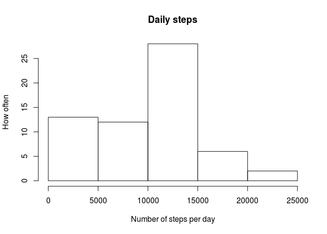

# Reproducible Research: Peer Assessment 1


## Loading and preprocessing the data
Firstly, download the raw data, unzip it and read it into a data frame


```r
library(dplyr)
```

```
## 
## Attaching package: 'dplyr'
## 
## The following objects are masked from 'package:stats':
## 
##     filter, lag
## 
## The following objects are masked from 'package:base':
## 
##     intersect, setdiff, setequal, union
```

```r
url<-"https://d396qusza40orc.cloudfront.net/repdata%2Fdata%2Factivity.zip"
unzip("rep-data-activity.zip")
activity<-read.csv("activity.csv",header = T)
activity<-mutate(activity, date=as.POSIXct(date,format="%Y-%m-%d"))
```

## What is the mean total number of steps taken per day?

Group the activity by date (day) and summarise the number of steps

```r
byDay <- group_by(activity,date) %>%
    summarise(dailySteps = sum(steps, na.rm = T))
```

```r
avgStepsPerDay <- mean(byDay$dailySteps)
medianStepsPerDay <- median(byDay$dailySteps)
```

The average number of steps per day is: 9354.2295082  
The median number of steps per day is: 10395
  
A histogram of steps per day is shown below


```r
hist(byDay$dailySteps, xlab = "Number of steps per day", ylab="How often", main = "Daily steps")
```

 


## What is the average daily activity pattern?


## Imputing missing values


## Are there differences in activity patterns between weekdays and weekends?
