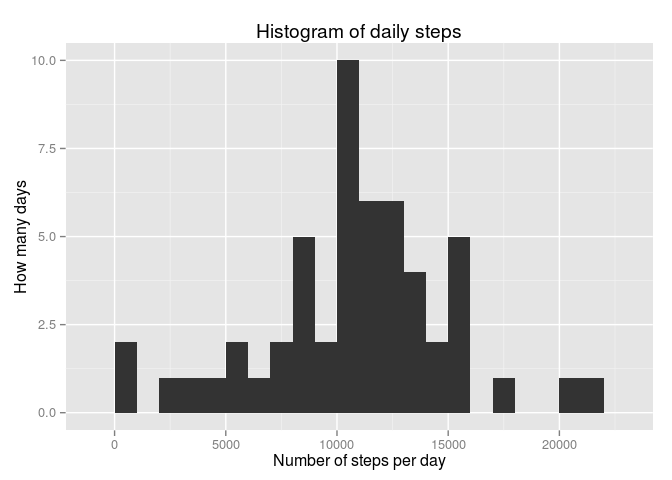
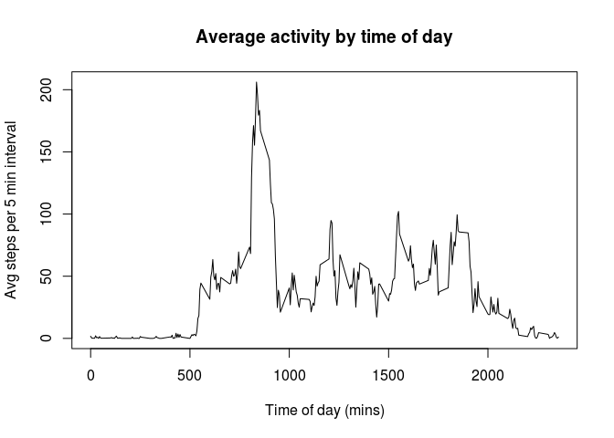
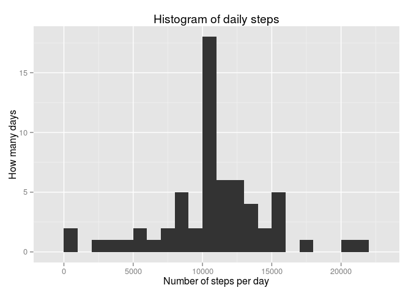

# Reproducible Research: Peer Assessment 1

```
## 
## Attaching package: 'dplyr'
## 
## The following objects are masked from 'package:stats':
## 
##     filter, lag
## 
## The following objects are masked from 'package:base':
## 
##     intersect, setdiff, setequal, union
```

## Loading and preprocessing the data
Analysis of data obtained from an activity monitor for an individual that measured the steps taken over a 5 minute period over a number of days. 

The raw data was downloaded and read it into a data frame, ready for the analysis.


```r
url<-"https://d396qusza40orc.cloudfront.net/repdata%2Fdata%2Factivity.zip"
download.file(url,"activity.zip")
unzip("activity.zip")
activity<-read.csv("activity.csv",header = T)
activity<-mutate(activity, date=as.POSIXct(date,format="%Y-%m-%d"))
```

## What is the mean total number of steps taken per day?

To analyse the number of steps per day, the activity data is grouped by day to summarise the number of steps taken. Note that days where no steps have been recorded have been removed from the dataset.


```r
byDay <- group_by(activity,date) %>%
    summarise(dailySteps = sum(steps, na.rm = T)) %>%
    filter(dailySteps != 0)
```

From this, we can derive the mean and median steps per day:


```r
avgStepsPerDay <- mean(byDay$dailySteps)
medianStepsPerDay <- median(byDay$dailySteps)
```

    * The average number of steps per day is: 10766.19  
    * The median number of steps per day is: 10765
  
A histogram of the recorded steps per day is shown below, to illustrate the relative frequency of steps per day. Note that this excludes days that had missing recorded values.


```r
qplot(dailySteps, data=byDay, geom="histogram",  xlab = "Number of steps per day", ylab="How many days", main = "Histogram of daily steps", binwidth=1000)
```

 

## What is the average daily activity pattern?

To observe how the daily activity varies across the day, below is a plot showing the average steps taken for each 5 minute period averaged across all measured days.


```r
byInterval <- group_by(activity,interval) %>%
    summarise(avgSteps = mean(steps, na.rm = T)) %>%
    mutate(hm = ISOdatetime(1970,1,1,interval%/%60,interval%%60,0)) %>%
    mutate(hmc = strftime(hm,format="%H:%M"))
plot(byInterval$hm,byInterval$avgSteps,type="l", xlab="Time of day", ylab="Avg steps", main="Average activity by time of day")
```

 


```r
maxInterval <- byInterval[byInterval$avgSteps==max(byInterval$avgSteps),c("interval","hmc")]
```

As can be seen the interval that has the highest average number of steps is 835 which equates to a time of day of 13:55

## Inputing missing values


```r
numNas <- nrow(activity[is.na(activity$steps),])
naPercent <- 100*numNas / nrow(activity) 
```

There are a number of missing values in the dataset - 2304, which is equivalent to 13.1147541 % of the total dataset. One strategy to remove any missing values is to replace them with the average step count for the particular interval that is missing. 

The daily step count can the be calculated on this new dataset.


```r
getAvg <- function(steps, intervals) {
        s <- vector(length=length(steps))
        for(i in 1:length(steps)) {
            if (is.na(steps[i])) {
                #Replace missing value with the average (across all days) for that interval
                s[i] <- byInterval[byInterval$interval == intervals[i],]$avgSteps
            } else {
                s[i] <- steps[i]
            }
        }
        s
}
synthed <- mutate(activity, steps=getAvg(steps, interval))
synthByDay <- group_by(synthed,date) %>%
    summarise(dailySteps = sum(steps, na.rm = T)) %>%
    filter(dailySteps != 0)
```

The average and median daily steps can then be recalculated on this data to show how the  synthesised value has changed them:


```r
avgStepsPerDay <- mean(synthByDay$dailySteps)
medianStepsPerDay <- median(synthByDay$dailySteps)
```

    * The average number of steps per day is: 10766.19  
    * The median number of steps per day is: 1.0766189\times 10^{4}

A histogram of the daily steps for this new dataset is shown below, which can be compared to the original data.


```r
qplot(dailySteps, data=synthByDay, geom="histogram",  xlab = "Number of steps per day", ylab="How many days", main = "Histogram of daily steps", binwidth=1000)
```

 

## Are there differences in activity patterns between weekdays and weekends?
